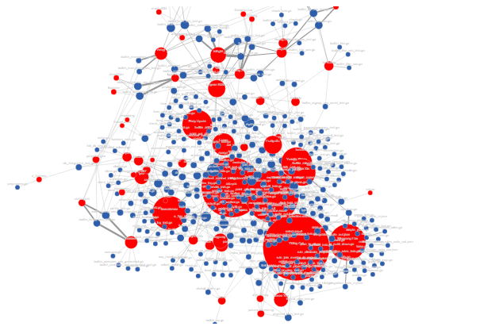

# GitHub 2019 数字年报

## 背景

2018 是“开源”的幸运数字，在这一年，“开源软件”从诞生开始，走过了整整 20 周年。随着开源软件的日趋风靡，开源已经成为一项世界性的流行运动，它是人类在互联网发展进程中探索出的一种面向全球的大规模协作生产方式，它以开放共享、合作共赢为宗旨，有效地推进了全球化进程。开源经过形成时期、古典时代、移动时代到云开源时代的不断发展，开源产业链条已经逐渐形成[5]。越来越多的中国IT企业，无论是大厂还是小厂，都越来越积极的投入人力物力，参与开源，贡献开源。开源代码代表着IT技术发展最先进的方向，开源社区代表着开放的协作精神与创新的摇篮[2]。

2018 年的时候，全球最大的代码托管平台 GitHub 已有 3000 万开发人员，囊括 200 万家企业或组织，拥有 9600 万个代码库，已提交 2 亿的 pull request。而在 GitHub 发布的 2019 年年度报告中[1]，开发人员则已经超过 4000 万，有将近 300 万个组织帐户，新创建的 repo 数超过了 4400 万个。目前的 GitHub，有超过 80％ 的开发者来自美国以外的地区，其中中国的贡献者数目仅次于美国，排名第二，中国的开发者 fork 并 clone 的项目比往年增加了48％。

近期陆续所发布的「中国开源年度报告」[2]和「中国开源项目 Grank 分析报告（2019）」[3]，则从另外一个方面说明了开源在中国受关注的程度。这些报告要么是通过问卷调查的形式进行的数据采集，要么是通过 GitHub API 定向采集的局部数据进行的分析，并且报告中所利用的指标也较为单一[3][4]，难以准确的体现开源世界的全貌。我们认为，一份有价值的报告必定是基于全域大数据的基础上，结合专家进行关键数据的人工标注，通过构建合理的分析模型，才能得出一套相对完整的，可以反复进行推演的数据报告（报告、数据、算法均需开源）。

为此，X-lab 开放实验室在这些报告的基础上，试图进一步更加全面的对 GitHub 上开发者的行为数据进行分析，尽量客观准确的展现目前开源世界所发生的事请，特别是中国的开发者和企业组织在整个开源产业中的表现和趋势，并正式发布这份「GitHub 2019 数字年报」。本报告采用 GitHub 全域事件日志进行统计分析（2019 年共计 5.46 亿条），并对分析出的前 1500 个项目进行人工标注，挑选出中国的个人开发者和企业组织，同时构建了科学合理的数学模型进行分析。更重要的是，本报告所包括内容、数据、算法采取开源的方式，一是方便大家进行复现本报告中的相关结论，更重要的是在此基础之上的不断优化，甚至二次创新。相信这样一种方式的数字报告能够给大家带来最大的价值。

参考文献：

[1]. GitHub 官方 2019 年度报, [https://octoverse.github.com/](https://octoverse.github.com/)

[2]. 中国开源年度报告, [https://kaiyuanshe.cn/project/china-open-source-report/](https://kaiyuanshe.cn/project/china-open-source-report/)

[3]. 中国开源项目 Grank 分析报告（2019）, [https://linux.cn/article-11755-1.html](https://linux.cn/article-11755-1.html)

[4]. 徐川, 覃云, 中国互联网公司开源项目调研报告, [https://www.infoq.cn/article/G4O6JUhJF*Tsv9eWM0L6](https://www.infoq.cn/article/G4O6JUhJF*Tsv9eWM0L6)

[5]. 云计算开源产业联盟, 开源产业白皮书（2019）, 2019 云计算开源产业大会, 北京.

## 数据集及方法

### 数据集

本报告采用 GitHub 全域事件日志进行统计分析，日志采集范围为 UTC 时间 2019-01-01T00:00:00Z 至 2020-01-01T00:00:00Z 共计约 5.46 亿条。关于 GitHub 事件日志相关说明，请参考 [GitHub 官方文档](https://developer.github.com/v3/activity/events/)。

### 方法

本报告中所有数据均基于 GitHub 事件日志统计，统计模型包含如下几个关键定义：

#### 开发者活跃度

开发者活跃度，其定义为某特定 GitHub 账号在一段时间内在某特定 GitHub 项目中的活跃评价指标。其活跃度由该账号在该项目中的行为数据决定，本报告中所关心的行为包含如下几种：

* Issue comment：在 issue 中参与讨论是最基本的行为，每个评论计入 1 次。
* Open issue：在项目中发起一个 issue，无论是讨论、Bug 报告或提问，对项目都是带来活跃的，每个发起的 issue 计入 1 次。
* Open pull request：为项目提交一个 PR，表示已对该项目进行源码贡献，则每次发起一个 PR 计入 1 次。
* Pull reuqest review comment：对项目中的 PR 进行 review 和讨论，需要对项目有相当的了解，并且对项目源码的质量有极大帮助，每个评论计入 1 次。
* Pull request merged：若有 PR 被项目合入，即便是很小的改动，也需要对项目有较为深入的理解，是帮助项目进步的真切贡献，则每有一个 PR 被合入计入 1 次。

以上 5 个种行为在该报告模型中，具有不一样的权重，其加权值逐级增加，加权值分别为 1、2、3、4、5，即：

#### 项目活跃度

项目活跃度，其定义为某特定项目在一段时间内的活跃评价指标。其活跃度由该段时间内在本项目中产生活跃的开发者活跃度加权计算得到，即：

使用开方的加权方式，用于抹平因核心开发者活跃度过高而导致项目活跃度过高，在该计算方式下，活跃度计算方式对参与人数较多而活跃情况平均的项目更加友好。

## 宏观统计结果

本次使用 2019 年全年 GitHub 日志进行统计，总日志条数约 5.46 亿条，相较 2018 年的 4.21 亿条增长约 29.7%。在上述开发者活跃度与项目活跃度的定义下，统计得到 2019 年总活跃项目数量约 512W 个，相较 2018 年的约 313W 增长约 63.6%，2019 年总活跃开发者数量约 360W，相较 2018 年的约 303W 增长约 18.8%。

对于这 512W 个项目的活跃度分布，如下图：

// TODO

对于这 512W 个项目的活跃开发者人数分布，如下图：

// TODO

## 世界 Top 10 开发者账号

根据上述给出的活跃度定义，我们对 2019 年全年活跃开发者进行了活跃度统计与排名，这里给出世界活跃度 Top 10 开发者账号列表：

从上述列表可以看到，世界活跃度 Top 10 开发者账号均为机器人账号，其中 7 个账号为 GitHub App，从这张列表中也可以看到开发者最常使用的自动化仓库管理、协作功能有哪些，主要集中在依赖更新、自动同步上游、学习、漏洞检测等。

另外，除活跃度外，还可以以活跃仓库数量进行排名，此类榜单中 Top 10 也均为机器人，从该表中也可以看到机器人的受欢迎程序。世界服务仓库最多的 Top 10 开发者账号列表如下：

世界活跃度与贡献项目数量 Top 1000 开发者列表请查询[这里](./DataSheet.xlxs)，所有开发者详情可由程序脚本获取。

## 世界 Top 10 项目

根据上述给出的项目活跃度定义，我们对 2019 年全年活跃项目进行了活跃度统计与排名，这里给出世界活跃度 Top 10 项目的列表：

世界活跃度与参与开发者数量 Top 1000 项目列表请查询[这里](./DataSheet.xlxs)，所有项目详情可由程序脚本获取。

## 中国 Top 20 项目分析

我们对所有排名的项目，筛选出了中国 Top 20 的项目，列表如下：

所有中国项目详情列表请查询[这里](./DataSheet.xlxs)，如若发现错误或遗漏，欢迎提交 Issue 或 PR 到 GitHub。

另外对于其中一些有代表性的项目，我们进行一些协作网络的分析。我们以 pingcap/tidb 和 vuejs/vue 为例，分析了仓库中开发者协同修改文件的网络图。

其中，pingcap/tidb 2019 年 10 月的协作网络如下图：

而 vuejs/vue 在同一时段的协作网络如下图：

图中红色节点为开发者账号，蓝色节点为仓库中的文件。红色节点越大，则表明该账号修改的文件数越多，而红蓝节点之间的边表示该账号修改过该文件，边的粗细表示修改次数。

可以明显看到，tidb 项目社区中有包含多个核心维护者，他们各自维护着不同的模块，周边也有大量的开发者在做出贡献。而 vue 项目中，大部分贡献都是由一个账号（尤雨溪）做出的，其他开发者出现的协作孤岛大多是文档等文件的修改。

由此可以看出不同类型的项目，他们的社区协作网络也呈现出完全不同的形态。更多顶级项目在 2019 年每月的协作网络图请查询[这里]()。

## 中国 Top 20 项目 Top Contributor 采访

对于中国 Top 20 的项目，我们分析了其每个项目中最活跃的开发者，并就其中的一些开发者进行了采访，为什么他们的项目可以如此活跃，社区管理和运营的技巧是什么？

// TODO

## 技术公司开源项目一览

各大开源项目，基本都有科技公司的支持，我们给出了一个科技公司维护的 GitHub 组织和项目列表，并根据该列表，计算了公司所维护的开源项目在 2019 年的活跃情况与开发者参与情况，结果如图：

如若发现数据错误或遗漏，欢迎提交 Issue 或 PR 到 GitHub。

## 展望

GitHub 2019 数据年报作为 X-lab 的首次 GitHub 数据年报，主要为大家提供了一些统计数据，并简单对社区协作关系做了一些分析工作。未来，X-lab 实验室将投入大量在校学生在 GitHub 数据挖掘的层面，旨在基于真实数据挖掘数据背后的价值，例如协作网络、社区管理、项目变迁等等，也希望可以在不久的将来，向社会提供这些数据分析的能力。

## 附录

X-lab 将随本报告同时开源本次报告的原始数据与分析程序。

### 原始数据

由于原始的日志文本数据数据量较大（约 1.45TB），故随本次报告的开源数据为统计后数据，data.json.gz 文件为压缩后的数据文件，总大小约为 225MB，解压后文件内容为文本内容，总大小约 1.3GB，总行数约 2169 万行。每行为一个记录项，由 JSON 格式编码，内容说明如下：

| 字段 | 类型   | 说明     | 
|:----|:-------|:--------|
| r   | string | 项目名称 | 
| u   | string | 账号名称 | 
| t   | number | 操作类型 | 
| c   | number | 操作次数 | 

其中操作类型的说明如下：

| 数值 | 含义           |
|:----|:---------------|
| 0   | Issue comment  | 
| 1   | Opne issue     |
| 2   | Open PR        |
| 3   | Reivew comment |
| 4   | PR merged      |

该文件不再区分具体日期，直接给出每个账号在每个项目中的全年操作次数，以方便处理。

由于原始数据体积较大，为方便使用，原始数据将通过 CDN 独立分发，地址为：[http://cdn.opensource-service.cn/github-analysis-report-2019/data.json.gz](http://cdn.opensource-service.cn/github-analysis-report-2019/data.json.gz)。

### 分析程序

分析程序随报告一同开源，地址为 [https://github.com/X-lab2017/github-analysis-report-2019](https://github.com/X-lab2017/github-analysis-report-2019)，具体使用方法请参考项目说明。
