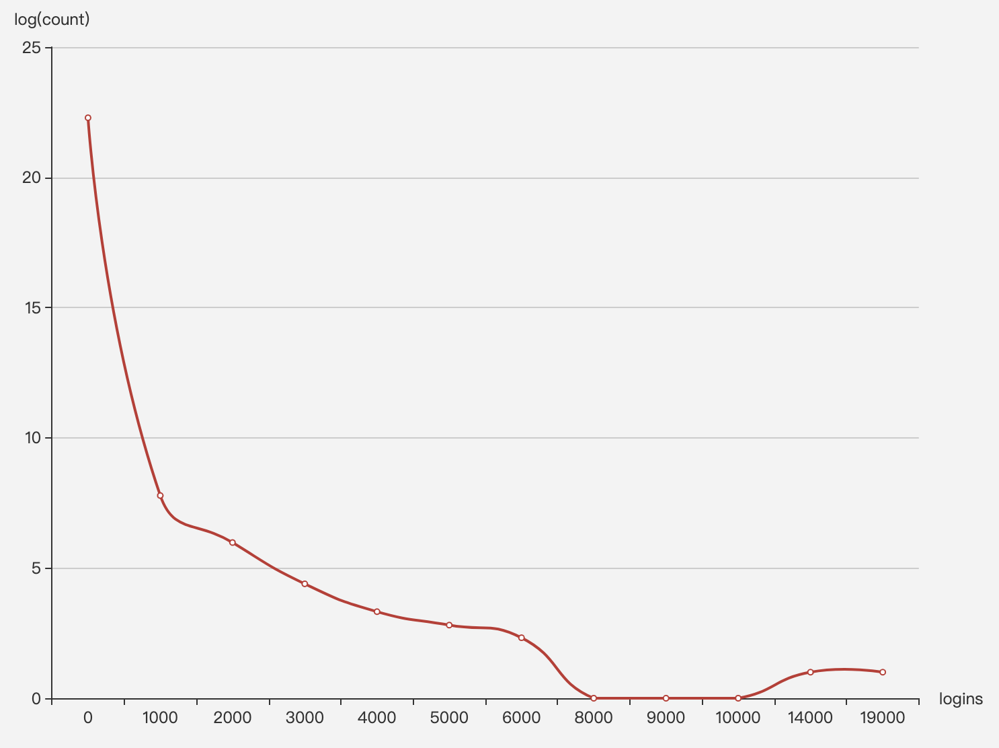
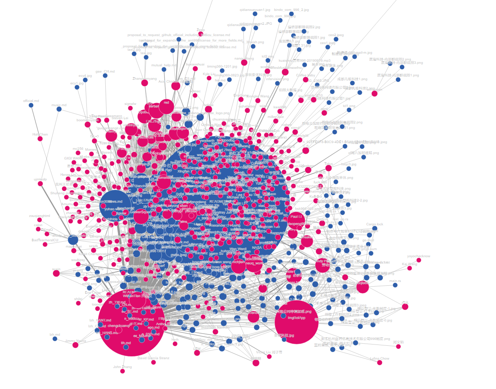
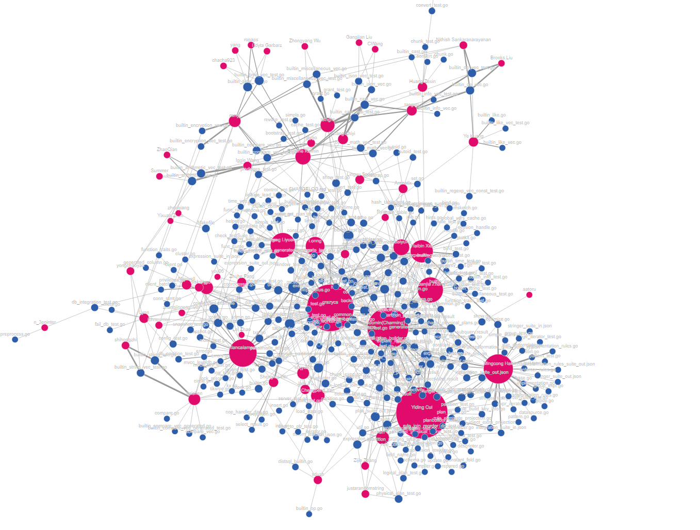
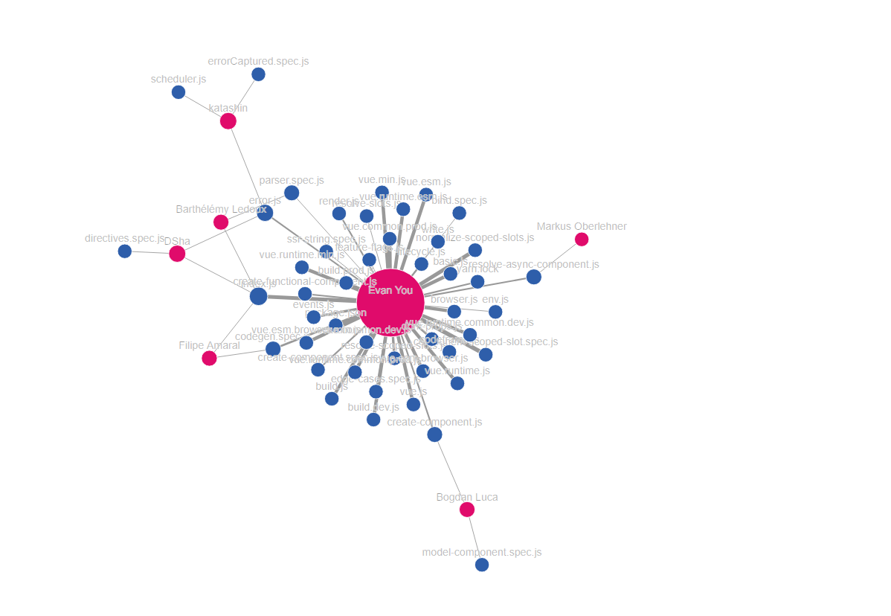
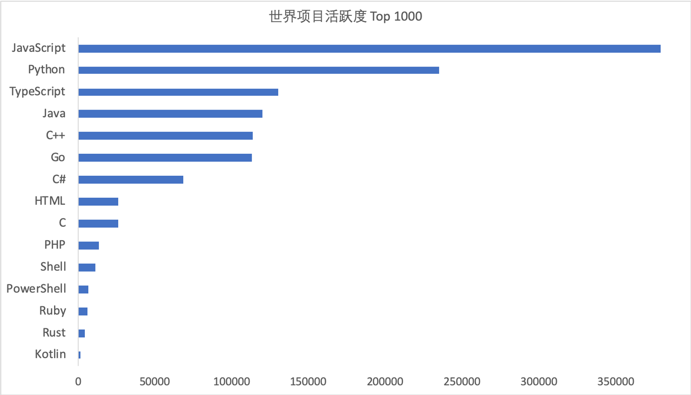

# GitHub 2019 Digital Annual Report

## Background

2018 is a lucky number for Open Source, in this year, Open Source has passed its 20 anniversary. With the unstoppable increasing popularity of open source software, open source has become a worldwide popular movement. It is a global-oriented large-scale collaborative production method explored by humans during the development of the Internet. It is based on open sharing, cooperation and win-win, effectively promoted the globalization process. After the continuous development of the open source era, the classical era, the mobile era, and the cloud open source era, the open source industry chain has gradually formed [5]. More and more Chinese IT companies, whether large or small, are increasingly actively investing manpower and resources to participate in and contribute to open source. Open source code represents the most advanced direction of IT technology development, and the open source community represents the spirit of open collaboration and innovation [2].

Until 2018, the most popular git platform - GitHub has 30 million developers, including 2 million copmanies or organizations, and 96 millions repositories with 200 million pull requests on it. While in the Octoverse report in 2019 from GitHub, the developers number has reached 40 million with 3 million organization account, new created repositories are more the 44 million. At present, 80% developers on GitHub are from outside USA. Among them, the number of contributors in China is second only to the United States while Chinese developers forked and cloned projects by 48% more than in 2018.

The recently released reports like China Open Source Annual Report[2] and China Open Source Projects Grank Analysis Report(2019)[3] successively illustrate the degree of open source's attention in China from another aspect. These reports are collecting data through the form of questionnaire surveys or from GitHub API to collect paticular repos and the indicators are quite simple too which is hard to give a comprehensive overview of global open source world. Gitee, the most popular code hosting platform in China, recently launched its own 2019 Data Report which also have the problems, but it is worthy of reference in many places. We believe the valuable report must be based on global big data, combined with the manual annotation of key data by experts and a reasonable analysis model which can be repeatly caculated(reports, data, algorithms need to be open source).

For these reason, X-lab attempts to analyze the behavioral data of developers on GitHub in a more comprehensive manner, and try to objectively and accurately show what is happening in the current open source world, especially in China. We are trying to show the trending of open source espeically on Chinese developers and companies, and officially publish the GitHub 2019 Digital Annual Report. The report is based on GitHub event logs from all over the world(more than 546 million records in 2019) and manually annotates the first 1500 projects. Individual Chinese developers and corporate organizations are selected, and scientific and reasonable mathematics is constructed. More importantly, the report, data, and algorithms included in this report adopt an open source approach. First, it is convenient for everyone to reproduce the relevant conclusions in this report. More importantly, continuous optimization based on this, and even secondary innovation. We believe that such a digital report can bring greate value to everyone.

References:

[1]. Octoverse 2019, [https://octoverse.github.com/](https://octoverse.github.com/)

[2]. China Open Source Annual Report, [https://kaiyuanshe.cn/project/china-open-source-report/](https://kaiyuanshe.cn/project/china-open-source-report/)

[3]. China Open Source Projects Grank Analysis Report(2019), [https://linux.cn/article-11755-1.html](https://linux.cn/article-11755-1.html)

[4]. Xu Chuan, Qin Yun, Survey Report on Open Source Projects of Chinese Internet Companies, [https://www.infoq.cn/article/G4O6JUhJF*Tsv9eWM0L6](https://www.infoq.cn/article/G4O6JUhJF*Tsv9eWM0L6)

[5]. OSCAR, Open source industry white paper (2019), 2019 Cloud Computing Open Source Industry Conference, Peking.

[6]. Gitee 2019 Data Report, [https://blog.gitee.com/2020/01/08/gitee-2019-annual/](https://blog.gitee.com/2020/01/08/gitee-2019-annual/)

## Data set and method

### Data set

The report uses GitHub event logs all over the world from UTC time 2019-01-01T00:00:00Z to 2020-01-01T00:00:00Z, including about 546 million records. About GitHub events, please refer to [GitHub Docs](https://developer.github.com/v3/activity/events/).

### Method

The report data is from GitHub event logs, the key definition of the model contains:

#### Developer activity

Developer activity which is the active index of a particular GitHub account in a time range on GitHub platform. The activity is caculated by the behavior of the account, the behavior data the report collects contains:

* Issue comment：the most basic disscussion activity on platform.
* Open issue：open an issue on a repository, no matter it is feature request, bug report or question.
* Open pull request：open a pull request on a repository which means solid soure code contribution to a project.
* Pull reuqest review comment：a review comment of a pull request on a repository which is quite helpful to the quality of the project.
* Pull request merged：a merged pull request means real source code contribution to a project.

The behaviors have different weight in the model, the weight is 1, 2, 3, 4, 5, which is:

#### Repository activity

Repository activity which is the active index of a particular GitHub repository in a time range on GitHub platform. The activity is caculated by the all the developers' activity on the repository, the formula is

We use square to process the developer activity so that high activity of a single developer will not cause high activity of the repository, in this manner, repository with more developers gonna get higher activity score.

## Macro results

This report uses GitHub 2019 all behavior logs all over the world, including 546 million records, 29.7% more than 2018. Under the activity formula above, we get 5.12 million repositories which is 63.6% more than 2018 and 3.6 million developer accounts which is 18.8% more than 2018.

For the activity distribution of these 512W projects, as shown below:

The distribution of the number of active developers for these 512W projects is shown below:

In the two figures, we used logarithmic coordinates. In fact, in all the repos, only 1399 repos had an activity value more than 1,000, accounting for less than three ten thousandths of the total number of repos; There are only 333 repos with more than 1,000 collaborate developers, which is less than one of thousands. This shows that most projects are still in a state of low activity and little collaboration.

## Global top 10 active developer accounts

Based on the definition of activity given above, we conducted an activity statistics and ranking of active developers throughout 2019, and here is a list of the world's top 10 developer accounts for activity:

From the above list, we can see that the world's top 10 developer accounts are robot accounts, and 7 of them are GitHub Apps. From this list, we can also see the most commonly automated project management and collaboration features used by developers. Which are mainly focused on dependency updates, automatic synchronization upstream project, GitHub learning, vulnerability detection, etc.

The world's activity top 1000 developer list please check [here] (./DataSheets.xlsx), all developer details can be obtained by the program.

## Global top 10 projects

Based on the definition of activity given above, we have conducted statistics and ranking of active projects throughout the year of 2019. Here is a list of the world's top 10 active projects:

The world's activity top 1000 project list, please check [here](./DataSheets.xlsx), all project details can be obtained by the program.

## Chinese top 20 projects analysis

For all the ranked projects, we have selected the top 20 projects in China. The list is as follows:

For a full list of all Chinese projects, please check [here](./DataSheets.xlsx). If you find any errors or omissions, please feel free to submit Issue or PR to GitHub.

From the list of top 20 projects, we can see that the comprehensive activity value of `996icu/996.ICU` is much higher than other projects. The highest indicator in this project is `open issue`, which is also an order of magnitude beyond other projects, reaching 22080, and the lowest indicator is `review comment`, which is only 144. `996.ICU`, as a phenomenon-level open source project, refers to the GitHub incident that occurred in March-April 2019. Chinese programmers released the `996.ICU` project in protest of the 996 working system, and obtained more than 200 thousand stars in a short time.

Two interesting projects in the list are `selfteaching/selfteaching-python-camp` and `Advanced-Frontend/Daily-Interview-Question`. These two projects have activity rankings of 4th and 13th, corresponding to education and interview job search. This aspect reflects the high demands and attentions of the public for these two areas.

Another very eye-catching project is `pingcap/tidb`. The `review comment` of this project is the highest of the 20 projects, reaching an astonishing 14913. In contrast, the second `PaddlePaddle/Paddle` under this property only 60% of it, and `issue comment` is second only to `996icu/996.ICU`, `open PR` is second only to `selfteaching/selfteaching-python-camp` and `PaddlePaddle/Paddle`, respectively corresponds to the second and third digits of the attribute. The number of its 608 developer participation is far from other front-end projects, but it has such a high degree of activity. It can also see the hard core level of its community, and we will further analyze the project later in the report.

**repo collaboration diagram**

Aiming at the top 20 Chinese open source projects obtained by the above analysis, this part mines the historical commits records of the repos. Each commit record in a Git repository is generated by a contributor and has an impact on one or more files in the repository. Therefore, analysis of the commit records of all contributors in a specific period of time can reflect the contributor's activity level, collaboration mode and the attribute of the project community itself. We use tools to mine and analyze the commit records of the top 20 active projects in China and display them visually. For related data files, please click [here]().

On the time dimension, we focused on the submission records of the repos in 2019. For each repo, analyze the commit records of a single repo with the granularity of a single month and the whole year, and use the bipartite graph as the content contribution model of the repo. The blue nodes in the visualization of the data file represent the repo file, and the red nodes represent the developer. The larger the node, the more the content of the file modified by the developer corresponding to the account, and the thickness of the edges between nodes reflects the number of contributions.

We use several typical examples to illustrate the analysis results. From the visualized collaboration diagram, the `996.ICU` project began to have submission records in March, and was most active in March and April, after which the heat began to diminish. The project's collaboration diagram structure shows a "binary" form, that is, there is a major contributor (`n_996Icu` in the figure, and another relatively large user node `ImgbotApp` is a robot account). The content of most files in the network consists of what this account contributes, and there is a file `README.md` which was most frequently modified. Most of the contributing accounts only make contributions to this file. Among them, the contribution of `n_996Icu` to `README.md` is the most frequent. This can be seen from the link weight between the two. This model's contribution map in March can be clearly observed.

From the collaboration diagram of the `tidb` project, there are multiple core maintainers in the entire community. They each maintain different modules, and a large number of developers are contributing around. From the data of a single month, the community commits changes frequently every month. Compared to other projects, `tidb` evolves and updates at a faster rate. In contrast, other projects have far less active monthly contributions and diversity of contributors than the `tidb` project. Taking two projects under `vuejs` (`vue-cli` and `vue`) as examples, in the `vuejs/vue-cli` project, it can be seen from the monthly contribution map that most of the contribution of this project is (`Haoqun Jiang`), no more than two main contributors in a single month. Most of the `vuejs/vue` contributions are made by an account (`Evan You`). After April of this project, the content contribution map showed the form of many collaborative islands, reflecting the contribution of contributors to a small number of files.

**996.ICU March collaboration diagram**

**996.ICU 2019 anuual collaboration diagram**

**tidb October collaboration diagram**

**tidb 2019 annual collaboration diagram**

**vue March collaboration diagram**

**vue April collaboration diagram**

From this we can see that for different types of projects, their community collaboration network also showed a completely different form. Please click [here](./network) for more monthly collaboration diagrams of top projects in 2019.

**References**

[PyDriller](https://pydriller.readthedocs.io/en/latest/)  : [D. Spadini, M. Aniche, and A. Bacchelli, PyDriller: Python Framework
for Mining Software Repositories, 2018.](https://www.sback.it/publications/fse2018td.pdf) 

[PathPy](https://www.pathpy.net/) Ingo Scholtes, “Software Package pathpy,”, 2017, [Online].

Git2net: [C. Gote, I. Scholtes, and F. Schweitzer, git2net - Mining Time-Stamped Co-Editing Networks from Large git Repositories, 2019 ](https://arxiv.org/pdf/1903.10180.pdf) 

## Development language analysis

We conducted statistics on the development languages ​​of the top 1000 projects in activity, the top 1000 projects in developer count and the Chinese open source projects. We can find that JavaScript is the most used. The reason for the guess is as follows:

* Java, Python and other languages ​​also account for a large proportion, but most projects developed in these languages ​​will also use Javascript at the same time. Many times Javascript is an indispensable language in the development of other languages.
* There are many open source Javascript projects in GitHub.

Among the top 1000 projects in activity and the top 1000 projects in developer count, Python is the second most used project, probably because:

* Python is more readable, easier to learn, and easier to maintain than other programming languages.
* Python has a wide range of applications. It comes with a variety of modules plus rich third-party modules, which saves a lot of "repetitive wheel" work, and can implement multiple functions faster.
* The wave of artificial intelligence has further promoted the development of Python. Many artificial intelligence tasks and big data analysis will be implemented in Python first.

The use of Python in Chinese open source projects is less compared to Java, Go, and C++.

## Interview with top open source projects in China

We interviewed some top open source project leaders in China. What do they think about the current open source in China? And why their projects can be so active, what are the skills of community management and operation?

### **Tan Zhongyi**

> Baidu open source office director, PaddlePaddle/Paddle

I am glad to see that PaddlePaddle is relatively active on the list of active projects in China.

Here is a brief introduction to the community management experience of the PaddlePaddle team. Because it is an open source project, it is very important to adhere to openness and transparency. The research and development process also needs to be open and transparent.

Therefore, the daily development of paddle is all conducted on GitHub, and there will be no internal version (that is, some companies' open source projects are developed in-house and new versions are regularly released).

In addition, for the problems feedback from the developers during the development and operation process, they are also guided to GitHub to raise issues, so there is a record and a precipitate, instead of answering the questions in the WeChat group / QQ group, which makes the problem difficult to be recorded. And used as a reference by subsequent engineers.

An open and transparent R&D process is very important to gain trust from the open source community.

### **Wu Sheng**

> apache/skywalking

In 2019, China's open source has made great progress, and its activity, participation and companies have increased significantly. Generally speaking, there are the following two characteristics.

First, leading by companies. A number of open source projects initiated by Chinese companies, especially projcets entering Apache, Linux, CNCF and other foundations, have been widely used at home and abroad. The community's ability to diversify has been greatly improved.

Second, personally-created projects rely on personal leadership, and community development can also become excellent projects. Although the number is still scarce, the winners are very prominent, even exceeding most companies' open source projects.

It needs to be added that a number of founding companies with open source as the core have emerged, which has injected a lot of vitality and global elements into open source.

But at the same time, the shortcomings are also very obvious. Currently, 90% of the mainstream and widely used open source projects come from a single commercial company, but there are few cross-company cooperation and co-construction projects. The open source projects that started China lacked help when seeking greater success globally.

At the same time, the gap between the first echelon and other open source teams is further widening. Top open source projects have begun to focus on the international market, and most open source projects are still confused about the community's starting and project choices.

Finally, the growth potential of students for open source project is very high, their knowledge of open source, their enthusiasm for participation, and their ability to participate are far below the requirements and expectations of the industry and global levels.

### **Huang Dongxu**

> PingCAP CTO, pingcap/tidb, tikv/tikv

For database products, if you want to have a community, you first need to have users. The more users, the larger the community. In the early days, we focused on Internet companies. Internet companies adopted new technologies with shorter time and more frequent technical exchanges. In addition, the most important thing is that Internet companies are business-driven and less affected by business. They are more suitable for startups or new companies. Product penetration and a firm foothold in the Internet industry will bring a signal to the community that this product wins with technology. On the other hand, engineers from Internet companies will also become community seed users. The second stage is the governance of the community. We have a very complete set of community operating rules, completely transparent to the community. Each promotion of Contributor has a clear roadmap, and friends from the community can better participate. In general, users and communities are complementary.

In addition, I think there are several early decisions that are critical to the success of the TiDB community:

* MySQL protocol compatible, identify the pain points of the MySQL community on scalability issues, and solve existing and common problems.
* The structure is highly layered, keeping the structure clear and allowing the community to participate with a low threshold.
* Always listen to the voices of front-line users, speak humanly, and keep the documents complete (including Chinese and English).
* Stand on the shoulders of giants and actively leverage various communities, such as Etcd, RocksDB, Go, and Rust.

## List of open source projects from technology companies

All major open source projects are basically supported by technology companies. We give a list of GitHub organizations and projects maintained by technology companies in China, and based on this list, calculate the active value and developers of open source projects maintained by the company in 2019, the results are shown in the figure:

If you find data errors or omissions, please submit an issue or PR to GitHub.

## Outlook

The GitHub 2019 Annual Digital Report is X-lab's first GitHub data annual report. It mainly provides some statistical data for everyone, and does some simple analysis of the community collaboration relationship. In the future, X-lab will invest a large number of students at the GitHub data mining, aiming to mine the value behind the data based on real open source world, such as collaborative networks, community management, project changes, etc., and hope that in the near futurem, we can provide the online ability to analyze these data.

## Appendix

X-lab will open source the raw data and analysis program for this report at the same time.

### Raw data

Because the original log text data has a large amount(about 1.45TB), the open source data accompanying this report is statistical data. The `data.json.gz` file is a compressed data file with a total size of about 225MB. The file content is text content with a total size of approximately 1.3GB and a total number of lines of approximately 21.69 million. Each line is a record item, which is encoded in JSON format. The content description is as follows:

| Field | Type   | Desc     |
|:------|:-------|:---------|
| r     | string | Repo     |
| u     | string | Account  |
| t     | number | Op Type  |
| c     | number | Op Times |

The description of the operation types is as follows:

| Value | Desc           |
|:----|:---------------|
| 0   | Issue comment  |
| 1   | Opne issue     |
| 2   | Open PR        |
| 3   | Reivew comment |
| 4   | PR merged      |

The file no longer distinguishes specific dates, and directly gives the number of operations per year for each account in each project for easy processing.

Due to the large size of the original data, for convenience, the original data will be distributed independently through the CDN at the address: [http://cdn.opensource-service.cn/github-analysis-report-2019/data.json.gz](http://cdn.opensource-service.cn/github-analysis-report-2019/data.json.gz)。

### Analysis program

The analysis program is open source along with the report at [https://github.com/X-lab2017/github-analysis-report-2019](https://github.com/X-lab2017/github-analysis-report-2019). Please refer to the project description for specific usage.
